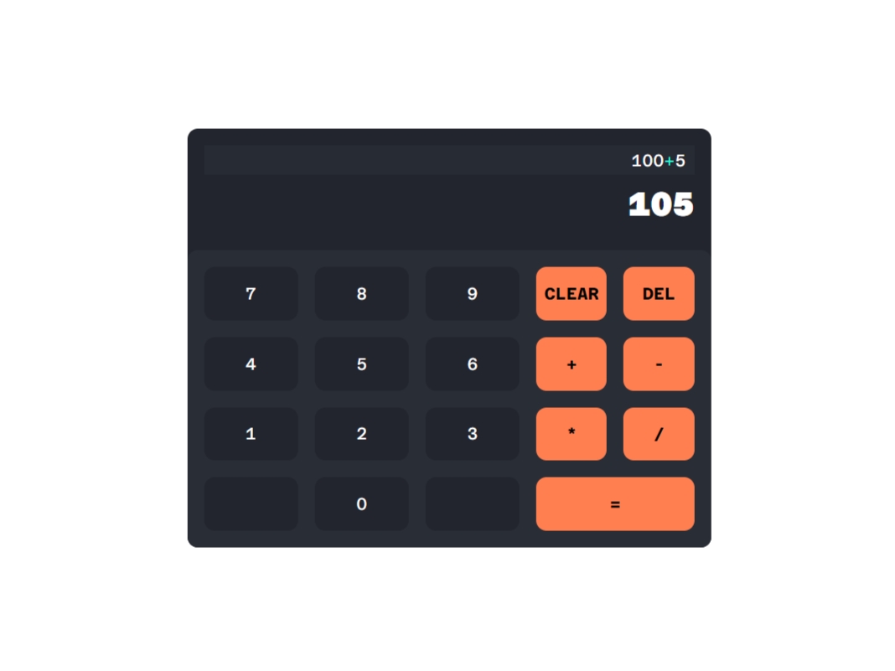

# Simple Calculator

A simple JavaScript calculator app that performs basic arithmetic operations. This app is perfect for anyone looking for a straightforward and easy-to-use calculator.

## Features

- Addition, subtraction, multiplication, and division operations
- Clear and intuitive user interface
- Responsive design suitable for various screen sizes

## Getting Started

### Prerequisites

To run this app, you need a web browser that supports JavaScript.

### Usage

1. You can clone this repository and open the `index.html` file to preview the app, alternatively, you can view the [live preview](https://ejmabunda.github.io/top-foundations-simple_calculator).

### Project Structure

- `index.html` - The main HTML file containing the structure of the calculator.
- `css/styles.css` - The CSS file for styling the calculator.
- `js/scripts.js` - The JavaScript file containing the logic for the calculator operations.

### Example

### Acknowledgments

- Inspired by classic calculator designs and various JavaScript tutorials.

---

Feel free to reach out if you have any questions or suggestions!
